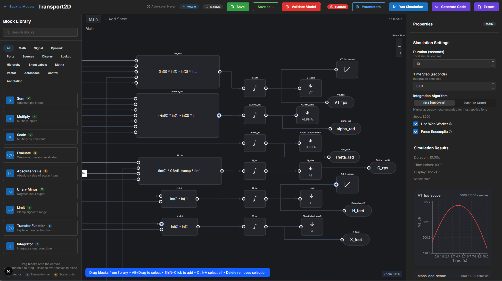

# obliq-2

A web-based visual modeling and simulation tool that enables users to construct, test, and simulate block diagram models directly in the browser, then generate C code for embedded deployment.

> **Important Note**: This project was almost entirely generated using Claude Opus and Sonnet 4 LLMs.  It is an exploration of how LLMs might help humans generate code - the code this application generates and the overall security of the application have not been formally verified. **In short, you'd be crazy to try to use this application for anything other than research.**

## Overview

obliq-2 is a browser-based application, designed for creating and simulating visual block diagram models. Users can drag and drop various block types onto a canvas, connect them with wires to define signal flow, run simulations to see how signals propagate through the system, and generate PlatformIO-compatible C code for deployment on embedded systems.



## Key Features

### Visual Modeling
- **Drag-and-drop interface** for building block diagrams
- **Multiple block types** including:
  - Mathematical operations (Sum, Multiply, Matrix Multiply, Scale, Trig functions, Vector functions, general math expressions)
  - Dynamic systems (Integrators and Laplace Transfer Functions)
  - Data operations (1D/2D Lookup Tables)
  - Visualization (Signal Display with plotting)
  - Signal generation (Source blocks for constants and generators)
  - Hierarchical composition (Subsystem blocks)
  - Conditional Signal Flow Control
  - Discontinuities (Relay, Rate Limiter, Quantizer, Edge Detect)
  - Model-scoped Data Stores for cross-sheet signals
  - Aerospace utilities (orientation and units conversion, 1976 COESA atmosphere)
  - Signal type conversion

### Multiple Signal Types: Scalars, Vectors, and Matricies
- Support for C-style data types: `float`, `double`, `long`, `bool`
- 1D vector and 2D matrix support (e.g., `double[3]`, `float[3][3]`)
- Automatic type propagation through connections
- Type validation with visual error indicators

### Supported Block Types

| Block Type | Display Name | Category | Description |
|------------|--------------|----------|-------------|
| `source` | Source | Sources | Provides constant or signal generator output (step, ramp, sine, chirp, noise) |
| `clock` | Clock | Sources | Outputs current simulation time in seconds as a double scalar |
| `input_port` | Input Port | Ports | External input to a model or subsystem |
| `output_port` | Output Port | Ports | External output from a model or subsystem |
| `sum` | Sum | Math | Sums multiple input signals with configurable signs (+/-) |
| `multiply` | Multiply | Math | Element-wise multiplication of multiple input signals |
| `divide` | Divide | Math | Element-wise division (num/den); scalar denominator broadcasts over a vector/matrix numerator |
| `scale` | Scale | Math | Multiplies input by a scalar constant (gain) |
| `abs` | Absolute Value | Math | Absolute value of scalar input |
| `uminus` | Unary Minus | Math | Negates input (element-wise for vectors/matrices) |
| `square` | Square (x²) | Math | Element-wise square: y = u² (scalar, vector, or matrix) |
| `sign` | Sign | Math | Signum function: −1, 0, or +1 (element-wise for vectors/matrices) |
| `limit` | Limit | Math | Clamps signal values to specified upper/lower range |
| `evaluate` | Evaluate | Math | Evaluates custom C-style expression with multiple inputs |
| `trig` | Trig | Math | Trigonometric functions (sin, cos, tan, asin, acos, atan, atan2) |
| `transfer_function` | Transfer Function | Dynamic | Laplace transfer function with RK4 integration |
| `discrete_transform` | Discrete Transform | Dynamic | Discrete-time z-transform transfer function |
| `integrator` | Integrator | Dynamic | Integrator block (1/s) with optional limits and reset |
| `unit_delay` | Unit Delay | Dynamic | Unit delay (z⁻¹): outputs the previous sample; `sampleInterval` 0 means every step |
| `relay` | Relay | Discontinuities | Hysteresis switch: on when u ≥ onThreshold, off when u ≤ offThreshold |
| `rate_limiter` | Rate Limiter | Discontinuities | Limits the output's rate of change (units/sec) using the simulation time step |
| `quantizer` | Quantizer | Discontinuities | Rounds input to the nearest multiple of a quantum (element-wise) |
| `edge_detect` | Edge Detect | Discontinuities | Emits a one-step pulse on a rising, falling, or either edge |
| `lookup_1d` | 1-D Lookup | Lookup | 1-D lookup table with linear interpolation |
| `lookup_2d` | 2-D Lookup | Lookup | 2-D lookup table with bilinear interpolation |
| `matrix_multiply` | Matrix Multiply | Matrix | Matrix multiplication (A×B) or scalar multiplication |
| `transpose` | Transpose | Matrix | Matrix transpose; vectors [n] become [n][1] matrices |
| `mux` | Mux | Matrix | Multiplexer: combines scalars into vector or matrix |
| `demux` | Demux | Matrix | Demultiplexer: splits matrix/vector into scalar outputs |
| `selector` | Selector | Matrix | Selects vector elements by 0-based index (scalar output for a single index) |
| `cross` | Cross Product | Vector | 3D vector cross product (A × B) |
| `dot` | Dot Product | Vector | Vector dot product (A · B) |
| `mag` | Magnitude | Vector | Vector magnitude (Euclidean norm) |
| `if` | If | Control | Conditional selection based on control signal |
| `condition` | Condition | Control | Compares input against constant (>, <, >=, <=, ==, !=) |
| `data_store_write` | Data Store Write | Data | Writes a signal to a model-scoped named store, shared across sheets and subsystems |
| `data_store_read` | Data Store Read | Data | Reads a model-scoped named data store |
| `subsystem` | Subsystem | Hierarchical | Encapsulates another sheet as a reusable block |
| `signal_display` | Signal Display | Sinks | Real-time signal visualization during simulation |
| `signal_logger` | Signal Logger | Sinks | Logs signal values for CSV export |
| `no_connection` | No Connection | Sinks | Marks a signal as intentionally unused |
| `sheet_label_sink` | Sheet Label Sink | Sheet Labels | Receives signal for wireless routing within a sheet |
| `sheet_label_source` | Sheet Label Source | Sheet Labels | Outputs signal from corresponding sheet label sink |
| `orientation_conversion` | Orientation Conversion | Aerospace | Converts between Euler angles, DCM, and Quaternion (AIAA convention) |
| `units_conversion` | Units Conversion | Aerospace | Converts between SI and Imperial units |
| `body2quaternion_rates` | Body2Quat Rates | Aerospace | Converts body angular rates to quaternion rates |
| `atmosphere` | Atmosphere | Aerospace | 1976 COESA atmosphere: T, a, P, ρ versus geometric altitude (m) |
| `comment` | Comment | Annotation | Text annotation with Markdown and LaTeX math support |

Two further block types are supported by simulation and code generation but are
**not offered in the block palette** — they exist so that models converted from
Simulink round-trip correctly:

| Block Type | Description |
|------------|-------------|
| `saturation_dynamic` | Element-wise `clamp(u, lo, up)`, with the limits supplied as signals rather than parameters |
| `inertia_diag_pack` | Packs principal-axis inertia and its derivative into `[Ixx, Iyy, Izz, İxx, İyy, İzz]` for aerolib mass properties |

### Diagram Layout
- **Automatic arrangement** — right-click empty canvas and choose **Reorganize Block Arrangement** to lay the current sheet out left to right
- Sources are placed on the left and sinks (output ports, displays, loggers) on the right, with the columns between them ordered by signal flow
- Feedback loops are detected and properly handled
- Layout is **port-aware**: the vertical order of a block's output ports drives the vertical order of the blocks it feeds, and each block is pulled toward the port that feeds it so wires run straight wherever the geometry allows
- **Reorganize and Resize Block Arrangement** does the same, and additionally sizes subsystem blocks so their ports spread far enough apart for neighboring blocks to line up with them. This one writes block dimensions into the model, which is why it is a separate action
- Subsystem blocks can also be resized by hand: right-click the block, choose **Resize...**, and drag any corner handle. Dimensions are stored as optional `width` / `height` parameters

### Printing and PDF Export
- **Export as PDF...** in the toolbar renders the model as a printable document, one page per sheet
- Output is **true vector** — drawn from model data rather than captured from the screen — so large-format plots stay sharp and files stay small
- Options: file name, orientation, page size, scaling (100%, 50%, or scale to fit), large-sheet fitting, and print scope
- Page sizes cover US (Letter, Legal, Tabloid), ISO (A0–A5), and blueprint sizes (ANSI C–E, ARCH A–E, ARCH E1)
- Print scope selects the entire model, the current subsystem, or just the current sheet
- Optional **subsystem summary pages** list a subsystem's input and output ports, its parameters with types and values, and its sheet hierarchy
- Every page carries a footer with the model name, sheet path, page number, and print date

### Simulation Engine
- **Client-side simulation** - Models are compiled dynamically and executed as [Web Assemblies](https://webassembly.org/)
- Real-time signal visualization with Recharts
- Configurable time steps, duration, and integration methods
- Signal logging with CSV export capability
- Support for both continuous and discrete-time systems

### Code Generation
- **PlatformIO-compatible C code** generation
- Preserves signal and block names for readable code
- Generates structured APIs with input/output/state structs
- Support for Runge-Kutta 4th order or Euler integration in generated code

### Multi-User Support
- User authentication via Supabase
- Isolated model storage per user
- Auto-save functionality every 5 minutes
- Model management dashboard

### Automation and Model Building APIs + MCP Server
- RESTful API for CI/CD integration and model building
- Supports construction, automated validation, simulation, and code generation
- Token-based authentication for external systems
- per-user API Key management
- Includes an MCP server capable of interacting with these APIs

## Tech Stack

- **Frontend**: Mantine, Next.js (App Router), React, ReactFlow, TypeScript
- **Backend**: Next.js API Routes (serverless functions)
- **Database**: Supabase (PostgreSQL with JSONB for model storage)
- **Authentication**: Supabase Auth
- **State Management**: Zustand
- **Visualization**: Recharts for signal charting
- **Code Generation**: Server-side TypeScript to C transpilation
- **Model Compilation**: Custom Docker image with gcc and WASM tooling

## Installation and Development Setup

obliq-2 needs three things running together:

1. **Supabase** — Auth, Postgres (models), and Storage (WASM cache)
2. **This Next.js app** — `npm run dev` on port 3000
3. **Docker** — used by the app to compile models to WebAssembly when you click **Run Simulation**

There is no single “seed everything” command. You start Supabase, apply the SQL under [`database-scripts/`](./database-scripts/), configure `.env.local`, then create a user in the UI. Sample model JSON files are loaded separately (see [Loading sample models](#loading-sample-models-into-the-database)).

### Prerequisites

| Requirement | Notes |
|-------------|--------|
| **Node.js 20+** and npm | App and tests |
| **Docker** | Supabase self-host *and* WASM compile image (`obliq-emscripten`) |
| **Git** | Clone this repo and (for self-host) the Supabase Docker config |
| ~4–8 GB RAM free | Full self-hosted Supabase stack is heavy |

### 1. Clone and install the app

```bash
git clone https://github.com/rrainey/obliq-2.git
cd obliq-2
npm install
```

Copy the env template (you will fill keys after Supabase is up):

```bash
cp .env.local.example .env.local
```

### 2. Choose a Supabase backend

Pick **one** of the options below. Most local development that mirrors production uses **Option A** (self-hosted Docker).

#### Option A — Self-hosted Supabase with Docker (recommended)

Follow the official guide: [Self-Hosting with Docker](https://supabase.com/docs/guides/self-hosting/docker#manual-installation).

Example layout (sibling directories):

```text
~/src/
├── supabase-project/    # Docker Compose stack (API on :8000)
└── obliq-2/             # This application (dev server on :3000)
```

**Manual install (summary)** — pin to a current `self-hosted/v*` tag from the [Supabase tags](https://github.com/supabase/supabase/tags) list:

```bash
# Outside the obliq-2 tree
git clone --depth 1 --branch self-hosted/v0.8.0 https://github.com/supabase/supabase
mkdir -p ~/src/supabase-project
cp -rf supabase/docker/. ~/src/supabase-project/

cd ~/src/supabase-project
cp .env.example .env
printf 'ref=self-hosted/v0.8.0\n' > .supabase-version

# Generate secrets and API keys (do not use placeholder defaults in production)
sh utils/generate-keys.sh
sh utils/add-new-auth-keys.sh   # if present on your version

# Align Auth redirects with the Next.js app
# In .env set (or confirm):
#   SUPABASE_PUBLIC_URL=http://localhost:8000
#   API_EXTERNAL_URL=http://localhost:8000/auth/v1
#   SITE_URL=http://localhost:3000
# For local email signup without a real SMTP server:
#   ENABLE_EMAIL_AUTOCONFIRM=true

docker compose pull
sh run.sh start                 # or: docker compose up -d --wait
docker compose ps               # all services should be healthy
```

**Where credentials live**

| Value you need for obliq-2 | Source in `~/src/supabase-project/.env` |
|----------------------------|----------------------------------------|
| API base URL | `SUPABASE_PUBLIC_URL` (default `http://localhost:8000`) |
| Anon / publishable key | `ANON_KEY` or `SUPABASE_PUBLISHABLE_KEY` |
| Service role / secret key | `SERVICE_ROLE_KEY` or `SUPABASE_SECRET_KEY` |
| Studio login | `DASHBOARD_USERNAME` / `DASHBOARD_PASSWORD` |
| Postgres password | `POSTGRES_PASSWORD` |

Print them anytime:

```bash
cd ~/src/supabase-project && sh run.sh secrets
```

**Studio (dashboard):** open [http://localhost:8000](http://localhost:8000) and use the dashboard username/password.

> **Important:** `NEXT_PUBLIC_SUPABASE_URL` must be the **HTTP API gateway URL** (e.g. `http://localhost:8000`), **not** a `postgresql://…` connection string. The browser and `supabase-js` talk to Auth/REST/Storage over that URL.

**Local signup tip:** Default `ENABLE_EMAIL_AUTOCONFIRM=false` means new users never get confirmed without mail. For local dev, set `ENABLE_EMAIL_AUTOCONFIRM=true` in the Supabase `.env`, then `sh run.sh recreate` (or recreate the Auth service). Alternatively confirm users manually in Studio → Authentication.

**Google OAuth** on the login page only works if you configure OAuth in self-hosted Auth. Email/password works out of the box once autoconfirm (or manual confirm) is set.

Stop / start later:

```bash
cd ~/src/supabase-project
sh run.sh stop
sh run.sh start
```

#### Option B — Supabase CLI (lighter local stack)

If you prefer the official CLI project inside this repo (different ports than Option A):

```bash
# From obliq-2 root (requires Docker)
npx supabase start
npx supabase status   # prints API URL (often http://127.0.0.1:54321) and keys
```

Map those values into `.env.local`. You still must apply the SQL in [`database-scripts/`](./database-scripts/) — the CLI does not ship this app’s schema.

#### Option C — Hosted Supabase (cloud project)

1. Create a project at [supabase.com](https://supabase.com).
2. Project **Settings → API**: copy Project URL, `anon` key, and `service_role` key into `.env.local`.
3. Apply the same SQL scripts via the SQL Editor.

### 3. Configure `.env.local` (obliq-2)

Edit `obliq-2/.env.local` (see [`.env.local.example`](./.env.local.example)):

```env
# Self-hosted Docker defaults shown — use CLI/cloud values if you chose those options
NEXT_PUBLIC_SUPABASE_URL=http://localhost:8000
NEXT_PUBLIC_SUPABASE_ANON_KEY=<ANON_KEY from supabase-project .env>
SUPABASE_SERVICE_ROLE_KEY=<SERVICE_ROLE_KEY from supabase-project .env>

# Long random secrets (any secure strings) for server-side API routes
AUTOMATION_API_TOKEN=<openssl rand -hex 32>
MODEL_BUILDER_API_TOKEN=<openssl rand -hex 32>
```

| Variable | Used for |
|----------|----------|
| `NEXT_PUBLIC_SUPABASE_URL` | Browser + server Supabase client base URL |
| `NEXT_PUBLIC_SUPABASE_ANON_KEY` | Public client key (RLS applies) |
| `SUPABASE_SERVICE_ROLE_KEY` | Server-only: WASM cache, admin storage, bypasses RLS when needed |
| `AUTOMATION_API_TOKEN` | `/api/automations/...` |
| `MODEL_BUILDER_API_TOKEN` | Optional fixed Model Builder token (user tokens via UI also exist) |

Restart `npm run dev` after changing env vars.

### 4. Initialize the database schema

The incomplete single-table snippet that used to live in this README is **not enough**. The app stores model JSON in **`model_versions`**, tracks **`latest_version`**, and uses extra tables for API tokens and WASM caching.

Apply scripts **in this order** (full detail: [`database-scripts/README.md`](./database-scripts/README.md)):

1. `database-scripts/setup.sql` — `models` + RLS
2. `database-scripts/versioning.sql` — `model_versions`, removes inline `models.data`, adds `latest_version`
3. `database-scripts/03-API-tokens.sql` — `api_tokens`
4. `database-scripts/04-wasm-cache.sql` — cache metadata + metrics
5. `database-scripts/05-wasm-storage-bucket.sql` — Storage bucket `wasm-cache`

**Via Studio SQL Editor** (self-hosted: [http://localhost:8000](http://localhost:8000) → SQL Editor): paste each file and run.

**Via Docker `psql`** (self-hosted):

```bash
cd ~/src/supabase-project
SCRIPTS=~/src/obliq-2/database-scripts

for f in setup.sql versioning.sql 03-API-tokens.sql 04-wasm-cache.sql 05-wasm-storage-bucket.sql; do
  echo "=== $f ==="
  docker compose exec -T db psql -U postgres -d postgres < "$SCRIPTS/$f"
done
```

Sanity-check in SQL Editor:

```sql
SELECT table_name FROM information_schema.tables
WHERE table_schema = 'public'
  AND table_name IN ('models', 'model_versions', 'api_tokens', 'wasm_cache_metadata')
ORDER BY 1;
```

Optional connection check from the app tree:

```bash
node verify-setup.js
```

### 5. (Optional) WASM compile image for simulation

Needed before **Run Simulation** compiles models:

```bash
npm run wasm:build-docker
# Builds Docker image: obliq-emscripten:latest
```

See also [`WASM-SETUP-INSTRUCTIONS.md`](./WASM-SETUP-INSTRUCTIONS.md).

### 6. Start the web application

With Supabase already healthy:

```bash
cd ~/src/obliq-2
npm run dev
```

Open [http://localhost:3000](http://localhost:3000) → sign up / log in → **Models**.

Create a blank model from the UI to verify inserts into `models` + `model_versions` work under RLS.

### Loading sample models (Import)

From **My Models** (`/models`), use **Import** to create a new model from JSON. This matches the **Export** format and the fixtures under [`docs/sample-models/`](./docs/sample-models/):

```json
{
  "name": "Subs01",
  "data": { "version": "2.2", "sheets": [ ... ], "parameters": [ ... ], "globalSettings": { ... } }
}
```

**Recommended workflow**

1. Log in → **My Models** → **Import**.
2. Choose a file such as `docs/sample-models/Subs01.json`.
3. Confirm or edit the model name → **Import** (opens the editor).
4. Optionally add **Signal Display** / **Signal Logger** sinks (many fixtures only expose output ports).
5. **Run Simulation** (Docker + `npm run wasm:build-docker` required for compile).

Import always creates a **new** model (version 1); it does not replace an existing one. Bare `{ "sheets": [...] }` data objects are also accepted (name defaults from the file name).

SQL / Studio inserts remain possible for automation; they are no longer required for interactive use.
### Common setup mistakes

| Symptom | Likely cause |
|---------|----------------|
| Auth / network errors in browser | `NEXT_PUBLIC_SUPABASE_URL` is a `postgres://` URL instead of `http://localhost:8000` |
| “relation models does not exist” | Schema scripts not applied |
| Can create models but open is empty / errors on version | `versioning.sql` not applied (`model_versions` missing) |
| Signup hangs or “email not confirmed” | `ENABLE_EMAIL_AUTOCONFIRM` still false; no SMTP |
| Run Simulation compile fails | Docker not running or `npm run wasm:build-docker` never run |
| Studio 401 on :8000 | Wrong `DASHBOARD_USERNAME` / `DASHBOARD_PASSWORD` |
| Wrong port vs docs that mention 54321 | That port is **Supabase CLI**; self-hosted Docker defaults to **8000** |

### Development Commands

```bash
# Run tests
npm test

# Run tests in watch mode
npm run test:watch

# Run tests with coverage
npm run test:coverage

# Build for production
npm run build

# Start production server
npm start

# Run linter
npm run lint

# WASM Docker image + tests
npm run wasm:build-docker
npm run test:wasm

# Quick env / Docker / models-table check
node verify-setup.js
```

## Project Structure

```
obliq-2/
├── src/
│   ├── app/                          # Next.js App Router pages
│   │   ├── api/
│   │   │   ├── automations/          # Automation API (CI/CD, external triggers)
│   │   │   ├── compile-wasm/         # WASM compilation endpoint
│   │   │   ├── compile-wasm-stream/  # SSE-based WASM compilation
│   │   │   ├── generate-code/        # C code generation endpoint
│   │   │   ├── model-builder/        # Model Builder API (programmatic model construction)
│   │   │   └── tokens/               # API token management
│   │   ├── admin/                    # Admin pages (API metrics)
│   │   ├── login/                    # Authentication page
│   │   ├── models/                   # Model editor and dashboard
│   │   └── tokens/                   # Token management UI
│   │
│   ├── components/                   # React components
│   │   ├── BlockNode.tsx             # Main block rendering component
│   │   ├── CanvasReactFlow.tsx       # ReactFlow canvas wrapper
│   │   ├── BlockLibrarySidebar.tsx   # Drag-and-drop block palette
│   │   ├── SignalDisplay.tsx         # Real-time signal visualization
│   │   ├── SimulationDisplayPanel.tsx
│   │   ├── *Config.tsx               # Block configuration dialogs
│   │   └── ...
│   │
│   ├── lib/
│   │   ├── blocks/                   # Block module implementations
│   │   │   ├── BlockModule.ts        # Base block interface
│   │   │   ├── BlockModuleFactory.ts # Factory for creating block modules
│   │   │   └── *BlockModule.ts       # Individual block implementations
│   │   │
│   │   ├── codegen/                  # C code generation pipeline
│   │   │   ├── CodeGenerator.ts      # Main code generator orchestrator
│   │   │   ├── ModelFlattener.ts     # Flattens hierarchical models
│   │   │   ├── AlgebraicEvaluator.ts # Topological sort and evaluation order
│   │   │   ├── StateIntegrator.ts    # RK4 integration code generation
│   │   │   ├── HeaderGenerator.ts    # Header file generation
│   │   │   ├── SubsystemCodeGenerator.ts  # Segregated subsystem support
│   │   │   └── ...
│   │   │
│   │   ├── layout/                   # Auto-layout and shared block geometry
│   │   │   ├── autoLayout.ts         # Layered left-to-right arrangement
│   │   │   └── blockGeometry.ts      # Block sizes / port offsets (shared with the canvas)
│   │   │
│   │   ├── export/                   # PDF export
│   │   │   ├── pdfRenderer.ts        # Vector renderer (pdf-lib)
│   │   │   ├── pageSizes.ts          # US / ISO / blueprint page table
│   │   │   ├── sheetTree.ts          # Sheet enumeration, paths, print scope
│   │   │   └── blockGlyphs.ts        # Symbol classification + glyph work list
│   │   │
│   │   ├── simulation/               # Browser-side simulation engine
│   │   │   ├── WasmSimulationEngine.ts    # WASM-based simulation
│   │   │   ├── SimulationWorker.ts        # Web Worker for off-main-thread
│   │   │   ├── SimulationWorkerManager.ts # Worker lifecycle management
│   │   │   └── SimulationEngineFactory.ts # Factory for engine creation
│   │   │
│   │   ├── wasm/                     # WebAssembly infrastructure
│   │   │   ├── ServerWasmExecutor.ts # Server-side WASM execution
│   │   │   ├── WasmErrorParser.ts    # Emscripten error parsing
│   │   │   ├── cache/                # WASM module caching (Supabase Storage)
│   │   │   └── codegen/              # WASM-specific code generation
│   │   │
│   │   ├── blockTypeRegistry.ts      # Block type definitions and metadata
│   │   ├── blockFactory.ts           # Unified block creation
│   │   ├── blockParameterValidator.ts # Parameter validation/sanitization
│   │   ├── modelStore.ts             # Zustand state management
│   │   ├── signalTypePropagation.ts  # Type inference through connections
│   │   ├── connectionValidation.ts   # Wire validation logic
│   │   ├── c99Expression*.ts         # C99 expression parser/evaluator
│   │   └── ...
│   │
│   ├── hooks/                        # React hooks
│   └── types/                        # TypeScript type definitions
│
├── mcp-server/                       # MCP Server (Model Context Protocol)
│   └── src/
│       ├── index.ts                  # Server entry point (STDIO + HTTP modes)
│       ├── tools/
│       │   ├── model-management.ts   # create_model, get_model, list_models
│       │   ├── model-construction.ts # add_block, add_connection, etc.
│       │   ├── block-types.ts        # list_block_types (parameter discovery)
│       │   ├── simulation.ts         # run_simulation
│       │   ├── code-generation.ts    # generate_code
│       │   ├── validation.ts         # validate_model
│       │   └── batch-operations.ts   # batch_execute
│       ├── modelBuilderClient.ts     # Model Builder API client
│       └── client.ts                 # Automation API client
│
├── __tests__/                        # Test suites
│   ├── *-block.test.ts               # Block module unit tests (one file per block)
│   ├── codegen/                      # Code generation tests
│   ├── simulation/                   # Simulation engine tests
│   ├── wasm/                         # WASM compilation and execution tests
│   ├── integration/                  # Integration tests (Docker/PlatformIO)
│   └── utils/                        # Test utilities (TestModelBuilder, etc.)
│
├── design/                           # Architecture documentation
│   └── 00-architecture.md            # Comprehensive system architecture
│
├── docs/                             # API documentation
│   ├── automation-api.md
│   ├── model-builder-api.md
│   └── wasm-*.md                     # WASM documentation
│
├── examples/                         # Example scripts
│   └── model-builder-api/            # API usage examples
│
└── database-scripts/                 # Schema SQL (apply in order — see that folder’s README)
```

## Testing

The project includes comprehensive test suites for both the simulation engine and C code generation.

### Unit Tests

Run the standard test suite:
```bash
# Run all tests
npm test

# Run tests in watch mode
npm run test:watch

# Run tests with coverage
npm run test:coverage
```

### C Code Generation Tests

The C code generation tests use Docker to ensure consistent compilation environments. These tests:
- Generate C code from test models
- Compile the generated code using PlatformIO in a Docker container
- Execute the compiled binaries to verify correctness

#### Prerequisites

1. **Docker**: Ensure Docker is installed and running on your system
   - [Docker Desktop](https://www.docker.com/products/docker-desktop/) for Windows/Mac
   - [Docker Engine](https://docs.docker.com/engine/install/) for Linux

Obliq-2 leverages Docker to compile and link a simulation model for execution.  Thee compiled Web Assenblies are cached in Supabase.

2. **Initial Setup**: The test suite will automatically build the required Docker image on first run

#### Running Code Generation Tests

```bash
# Run C code generation and compilation tests
npm run test:codegen

# Run with verbose output
npm run test:codegen -- --verbose
```

### WebAssembly (WASM) Tests

**NEW:** The project now supports compiling models to WebAssembly for high-performance browser simulation.

WASM tests verify that:
- C code can be compiled to WebAssembly using Emscripten
- WASM modules load and execute correctly in both Node.js and browsers
- Generated models produce identical results when run as WASM

#### Running WASM Tests

```bash
# Build Emscripten Docker image (first time only)
npm run wasm:build-docker

# Run all WASM tests
npm run test:wasm

# Run specific WASM test suites
npm run test:wasm:setup   # Basic Emscripten setup
npm run test:wasm:model   # Full model compilation
```

#### Quick Start Guide

See [`__tests__/wasm/QUICKSTART.md`](__tests__/wasm/QUICKSTART.md) for a step-by-step verification guide.

**Documentation:**
- **Quick Start**: [`__tests__/wasm/QUICKSTART.md`](__tests__/wasm/QUICKSTART.md)
- **Full Documentation**: [`__tests__/wasm/README.md`](__tests__/wasm/README.md)
- **Architecture**: [`docs/wasm-simulation-architecture_1.md`](docs/wasm-simulation-architecture_1.md)
- **Implementation Roadmap**: [`docs/wasm-implementation-roadmap.md`](docs/wasm-implementation-roadmap.md)

The tests will:
1. Build a Docker image with PlatformIO if not already present
2. Generate C code for various test models
3. Create proper PlatformIO library structures
4. Compile the generated code in isolated Docker containers
5. Execute the compiled programs and verify outputs

#### Test Models

Test models are stored in `__tests__/integration/code-generation/models/` as JSON files. Each model can include:
- `metadata.testInputs`: Input values for testing
- `metadata.expectedOutput`: Expected output for validation
- `metadata.description`: Test case description

#### Troubleshooting

If tests fail:
1. Check Docker is running: `docker --version`
2. Verify the Docker image exists: `docker images | grep platformio-test`
3. Check test output for compilation errors


## Usage

1. **Create a Model**: Click "New Model" from the dashboard
2. **Build Your Diagram**: Drag blocks from the library and connect them with wires
3. **Configure Blocks**: Click blocks to set parameters (e.g., transfer function coefficients)
4. **Run Simulation**: Click "Run Simulation" to see signals propagate in real-time
5. **Tidy the Layout**: Right-click empty canvas and choose **Reorganize Block Arrangement**
6. **Generate Code**: Click "Generate C Code" to download a PlatformIO-compatible library
7. **Export Data**: Use Signal Logger blocks to capture and export simulation data
8. **Print or Share**: Click **Export as PDF...** for a printable document, one page per sheet

## License

This project is covered by the MIT License.

## Acknowledgments

This project was almost entirely generated using Claude Opus, demonstrating the capabilities of large language models in software development.