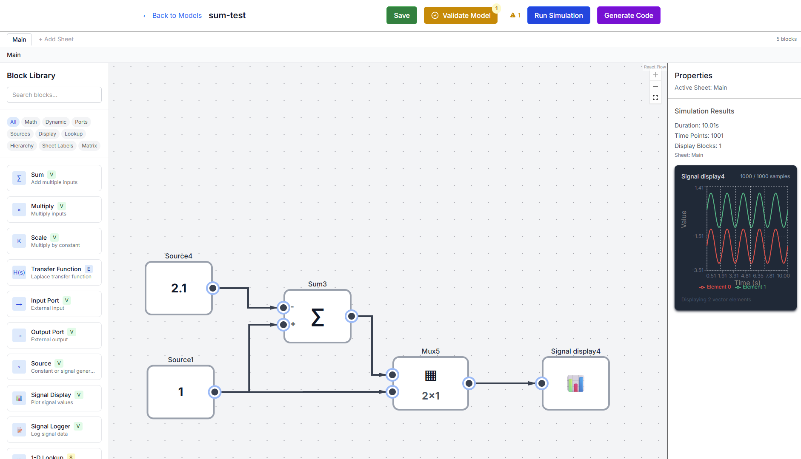

# obliq-2

A web-based visual modeling and simulation tool that enables users to construct, test, and simulate block diagram models directly in the browser, then generate C code for embedded deployment.

> **Note**: This project was almost entirely generated using Claude Opus LLM.

## Overview

obliq-2 is a browser-based application, designed for creating and simulating visual block diagram models. Users can drag and drop various block types onto a canvas, connect them with wires to define signal flow, run simulations to see how signals propagate through the system, and generate PlatformIO-compatible C code for deployment on embedded systems.



## Key Features

### Visual Modeling
- **Drag-and-drop interface** for building block diagrams
- **Multiple block types** including:
  - Mathematical operations (Sum, Multiply, Scale)
  - Dynamic systems (Laplace Transfer Functions with RK4 integration)
  - Signal routing (Input/Output Ports, Sheet Labels)
  - Data operations (1D/2D Lookup Tables)
  - Visualization (Signal Display with real-time plotting)
  - Signal generation (Source blocks for constants and generators)
  - Hierarchical composition (Subsystem blocks)

### Signal Type System
- Support for C-style data types: `float`, `double`, `long`, `bool`
- 1D array support (e.g., `double[3]`, `float[10]`)
- Automatic type propagation through connections
- Type validation with visual error indicators

### Simulation Engine
- **Client-side simulation** for responsive interaction
- Real-time signal visualization with Recharts
- Configurable time steps and duration
- Signal logging with CSV export capability
- Support for both continuous and discrete-time systems

### Code Generation
- **PlatformIO-compatible C code** generation
- Preserves signal and block names for readable code
- Generates structured APIs with input/output/state structs
- Support for Runge-Kutta 4th order integration in generated code

### Multi-User Support
- User authentication via Supabase
- Isolated model storage per user
- Auto-save functionality every 5 minutes
- Model management dashboard

### Automation API
- RESTful API for CI/CD integration
- Supports automated validation, simulation, and code generation
- Token-based authentication for external systems

## Tech Stack

- **Frontend**: Next.js (App Router), React, TypeScript, Tailwind CSS
- **Backend**: Next.js API Routes (serverless functions)
- **Database**: Supabase (PostgreSQL with JSONB for model storage)
- **Authentication**: Supabase Auth
- **State Management**: Zustand
- **Visualization**: Recharts for signal plotting
- **Code Generation**: Server-side TypeScript to C transpilation

## Installation

### Prerequisites
- Node.js 18+ and npm/yarn
- Supabase account (or local Supabase instance)

### Setup

1. Clone the repository:
```bash
git clone https://github.com/yourusername/obliq-2.git
cd obliq-2
```

2. Install dependencies:
```bash
npm install
# or
yarn install
```

3. Set up environment variables:
Create a `.env.local` file in the project root:
```env
# Supabase Configuration
NEXT_PUBLIC_SUPABASE_URL=your_supabase_url
NEXT_PUBLIC_SUPABASE_ANON_KEY=your_supabase_anon_key
SUPABASE_SERVICE_ROLE_KEY=your_service_role_key

# Automation API Token (generate a secure token)
AUTOMATION_API_TOKEN=your_secure_automation_token
```

4. Set up the database:
In your Supabase project, create the models table:
```sql
CREATE TABLE models (
  id UUID DEFAULT gen_random_uuid() PRIMARY KEY,
  user_id UUID REFERENCES auth.users(id) ON DELETE CASCADE,
  name TEXT NOT NULL,
  data JSONB NOT NULL,
  updated_at TIMESTAMP WITH TIME ZONE DEFAULT NOW()
);

-- Enable Row Level Security
ALTER TABLE models ENABLE ROW LEVEL SECURITY;

-- Create policy for users to manage their own models
CREATE POLICY "Users can manage their own models" ON models
  FOR ALL USING (auth.uid() = user_id);
```

## Running Locally

1. Start the development server:
```bash
npx supabase start -x vector

# then,
npm run dev
# or
yarn dev
```

2. Open your browser and navigate to:
```
http://localhost:3000
```

3. Create an account or log in to start building models.

### Development Commands

```bash
# Run tests
npm test

# Run tests in watch mode
npm run test:watch

# Run tests with coverage
npm run test:coverage

# Build for production
npm run build

# Start production server
npm start

# Run linter
npm run lint
```

## Project Structure

```
obliq-2/
├── app/                    # Next.js App Router pages
│   ├── api/               # API routes for automation and code generation
│   ├── login/             # Authentication pages
│   └── models/            # Model dashboard and editor
├── components/            # React components
│   ├── Canvas.tsx         # Visual modeling canvas
│   ├── Block.tsx          # Block component
│   └── ...                # Other UI components
├── lib/                   # Core business logic
│   ├── simulationEngine.ts # Simulation execution
│   ├── codeGeneration.ts  # C code generator
│   └── modelSchema.ts     # Model data structures
└── public/                # Static assets
```

## Testing

The project includes comprehensive test suites for both the simulation engine and C code generation.

### Unit Tests

Run the standard test suite:
```bash
# Run all tests
npm test

# Run tests in watch mode
npm run test:watch

# Run tests with coverage
npm run test:coverage
```

### C Code Generation Tests

The C code generation tests use Docker to ensure consistent compilation environments. These tests:
- Generate C code from test models
- Compile the generated code using PlatformIO in a Docker container
- Execute the compiled binaries to verify correctness

#### Prerequisites

1. **Docker**: Ensure Docker is installed and running on your system
   - [Docker Desktop](https://www.docker.com/products/docker-desktop/) for Windows/Mac
   - [Docker Engine](https://docs.docker.com/engine/install/) for Linux

2. **Initial Setup**: The test suite will automatically build the required Docker image on first run

#### Running Code Generation Tests

```bash
# Run C code generation and compilation tests
npm run test:codegen

# Run with verbose output
npm run test:codegen -- --verbose
```

The tests will:
1. Build a Docker image with PlatformIO if not already present
2. Generate C code for various test models
3. Create proper PlatformIO library structures
4. Compile the generated code in isolated Docker containers
5. Execute the compiled programs and verify outputs

#### Test Models

Test models are stored in `__tests__/integration/code-generation/models/` as JSON files. Each model can include:
- `metadata.testInputs`: Input values for testing
- `metadata.expectedOutput`: Expected output for validation
- `metadata.description`: Test case description

#### Troubleshooting

If tests fail:
1. Check Docker is running: `docker --version`
2. Verify the Docker image exists: `docker images | grep platformio-test`
3. Check test output for compilation errors


## Usage

1. **Create a Model**: Click "New Model" from the dashboard
2. **Build Your Diagram**: Drag blocks from the library and connect them with wires
3. **Configure Blocks**: Click blocks to set parameters (e.g., transfer function coefficients)
4. **Run Simulation**: Click "Run Simulation" to see signals propagate in real-time
5. **Generate Code**: Click "Generate C Code" to download a PlatformIO-compatible library
6. **Export Data**: Use Signal Logger blocks to capture and export simulation data

## License

This project is covered by the MIT License.

## Acknowledgments

This project was almost entirely generated using Claude Opus, demonstrating the capabilities of large language models in software development.